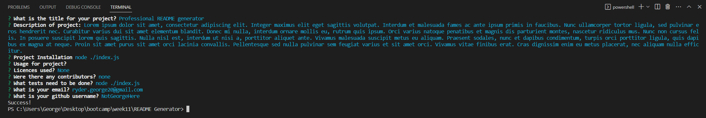
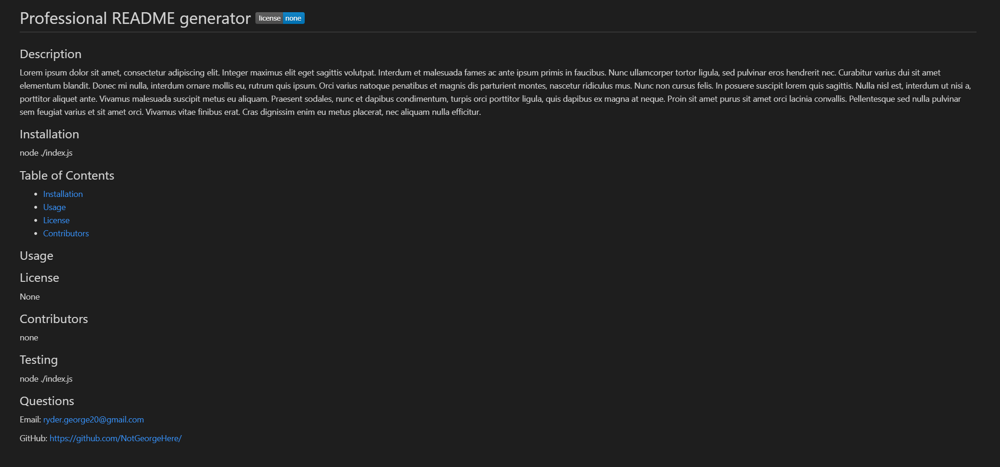

# George Ryder - Professional README Generator

## Description

A project designed to dynamically create a professional looking README.

My motivation behind this project was so that users could quickly, and efficiently, generate a README needed for their project. The process of creating a README can be a time consuming one so using some automation to speed this up will be a useful time saving feature. I built this project as it helped give me a much further understanding of using node and using NPM to use packages such as inquirer; I also gained a greater understanding of using fs to create and read to files. These were all technologies I had previously never used so gaining experience of using them was vital for the development of my javaScript skills. I also started to gain a greater understanding of how to use ES6, especially arrow functions and the use of const and let. This was important as it makes the code writing more efficient, and, in some cases more readable. This program does solve an important problem of streamlining the README creation process. Whilst it doesn't eliminate writing a README in its entirity, it does mean that the mundanities of formatting are eliminated which saves time in the long run. I learnt a lot during this project especially, as mentioned, ES6, node and using NPM modules and libraries and how to initialise and use all of these. If I were to develop this into the future I'd look at ways in which I can improve the efficency of code which I will hopefully be able to do with greater future experience.

## Installation

GitHub repository: https://github.com/NotGeorgeHere/Professional-README-Generator

Installation: node index.js in integrated terminal

## Usage

Integrated Terminal Information:

---

Test README example:

## License

FS, Inquirer, path, NPM